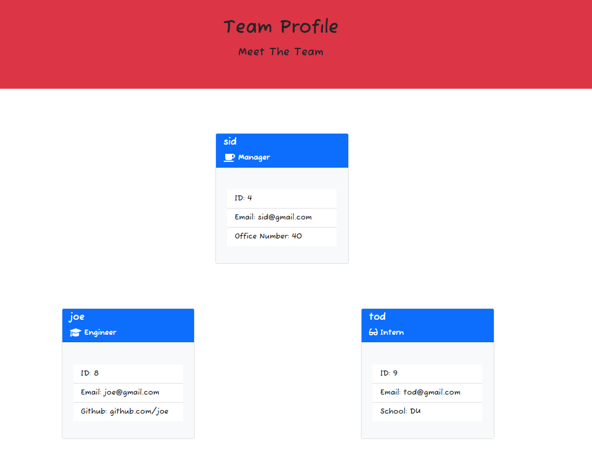
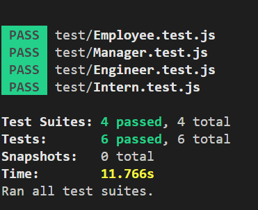
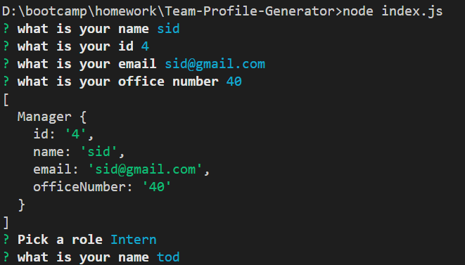

# Team-Profile-Generator
### Siddharth Desai

## Description

The purpose of this project was to build a command-line base application to generate a team profile html page. The user will be prompted with a series of questions through the command line using Inquirer and their answers are later used to generate the HTML page. The profiles are broken down into three role types: manager, intern and engineer. The user is only allowed one manager however has the ability to add as many interns and engineers as desired. Once the user is done adding interns and engineer profiles they can select “Finish building my team” in the command line options and this will generate the final HTML team profile page.

[](https://opensource.org/licenses/MIT)

## User Story

```md
AS A manager
I WANT to generate a webpage that displays my team's basic info
SO THAT I have quick access to their emails and GitHub profiles
```

## Acceptance Criteria

```md
GIVEN a command-line application that accepts user input
WHEN I am prompted for my team members and their information
THEN an HTML file is generated that displays a nicely formatted team roster based on user input
WHEN I click on an email address in the HTML
THEN my default email program opens and populates the TO field of the email with the address
WHEN I click on the GitHub username
THEN that GitHub profile opens in a new tab
WHEN I start the application
THEN I am prompted to enter the team manager’s name, employee ID, email address, and office number
WHEN I enter the team manager’s name, employee ID, email address, and office number
THEN I am presented with a menu with the option to add an engineer or an intern or to finish building my team
WHEN I select the engineer option
THEN I am prompted to enter the engineer’s name, ID, email, and GitHub username, and I am taken back to the menu
WHEN I select the intern option
THEN I am prompted to enter the intern’s name, ID, email, and school, and I am taken back to the menu
WHEN I decide to finish building my team
THEN I exit the application, and the HTML is generated
```

## Table of Contents
1. [ Description. ](#description)
2. [ Installation. ](#installation)
3. [ Usage. ](#usage)
4. [ License. ](#license)
6. [ Tests. ](#tests)
7. [ Questions. ](#questions)
8. [ Resources. ](#resources)
9. [ Links. ](#links)


## Installation
* Clone the repository using:
```
git clone git@github.com:shd327/Team-Profile-Generator.git
```
* Ensure you are in the current working directory
* Ensure all dependencies are installed as shown below installation instructions are below:
```
  "dependencies": {
    "inquirer": "^8.2.4",
    "jest": "^24.8.0"
  }

```
```
npm install jest
```
```
npm install inqurier
```

Run the the best team profile generator by typing the following in the terminal:
```
node index.js
```

## Usage
* Naviagte to the project directory in a integrated terminal
* Run the index.js (node index.js)
* Answer all the prompted questions in the terminal 
* Once "Finished building the Team" and index.html page will generate.
* To View right click the index.html file and open it in a broswer of your choice
* You have successfully generated and are now able to view your team profile

## License
MIT License

Copyright (c) 2022 Siddharth Desai

Permission is hereby granted, free of charge, to any person obtaining a copy
of this software and associated documentation files (the "Software"), to deal
in the Software without restriction, including without limitation the rights
to use, copy, modify, merge, publish, distribute, sublicense, and/or sell
copies of the Software, and to permit persons to whom the Software is
furnished to do so, subject to the following conditions:

The above copyright notice and this permission notice shall be included in all
copies or substantial portions of the Software.

THE SOFTWARE IS PROVIDED "AS IS", WITHOUT WARRANTY OF ANY KIND, EXPRESS OR
IMPLIED, INCLUDING BUT NOT LIMITED TO THE WARRANTIES OF MERCHANTABILITY,
FITNESS FOR A PARTICULAR PURPOSE AND NONINFRINGEMENT. IN NO EVENT SHALL THE
AUTHORS OR COPYRIGHT HOLDERS BE LIABLE FOR ANY CLAIM, DAMAGES OR OTHER
LIABILITY, WHETHER IN AN ACTION OF CONTRACT, TORT OR OTHERWISE, ARISING FROM,
OUT OF OR IN CONNECTION WITH THE SOFTWARE OR THE USE OR OTHER DEALINGS IN THE
SOFTWARE.

## Tests
* Ensure jest is installed (npm install jest)
* In the command line, write:
* Navigate to the /test directory
```
npm run test
```
* Confirm all four test suites pass (see screenshot below). Test suites are located in the test folder and are titled: Employee.test.js, Engineer.test.js, Intern.test.js, and Manager.test.js

## Questions?
Want to see more of my work? [Github Link](https://github.com/shd327)
<br/>
Want to learn more please contact me at shdesai327@gmail.com

## Screenshots






## Links
* https://shd327.github.io/Team-Profile/

## Resources
* https://www.npmjs.com/package/inquirer
* https://nodejs.org/en/
* https://opensource.org/licenses/MIT
* https://jestjs.io/

## Links
* [Video Link](https://drive.google.com/file/d/1P2nsGH4u6cVzVDSij4j_3Xr1-OAm9zXw/view?usp=share_link)
* [Github Link](https://github.com/shd327/Team-Profile-Generator)

